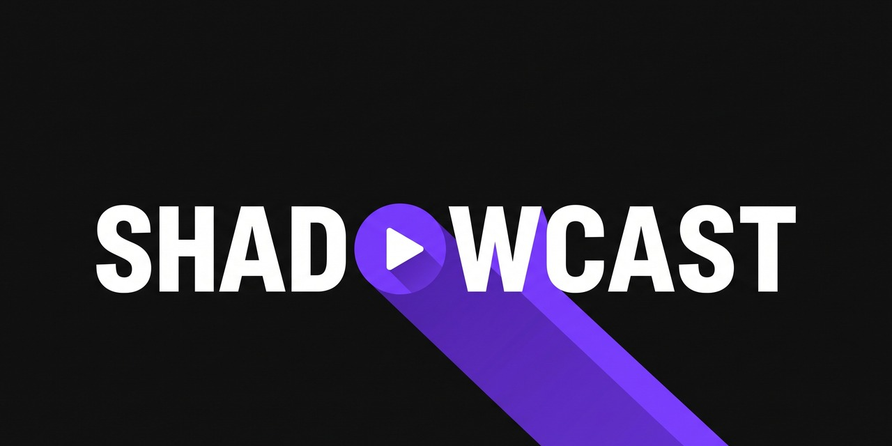
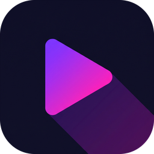

<p align="center"></p>

<p align="center"></p>

# Shadowcast

**Paste a YouTube channel link. Get your own original channel in that format, running on autopilot.**

Shadowcast is a Claude Code plugin, powered by Claude Opus 5.5. The flow:
1. **Audit:** it audits a channel you admire: cadence, length, titles, thumbnails, top videos. Gemini watches the best ones.
2. **Style bible:** it writes a style bible of *why* the channel works.
3. **Branding:** it sets your channel's branding in one of three ways:
   - **Your own branding:** point it at a folder of your logo and brand files, and it uses them exactly.
   - **Your website:** give it your URL and it pulls your name, tagline, logo, colours and fonts.
   - **Default:** it matches the reference channel's look (palette, font feel, thumbnail and graphics style) with an original name, logo, avatar and banner.
4. **Episodes:** it produces full episodes:
   - research and a fact sheet, and a script that waits for your approval
   - ElevenLabs voice-over
   - real licensed photos with automatic cut-outs
   - word-synced motion graphics (Remotion), a busiest-frame layout audit, and a render
   - **two native 9:16 Shorts** and 3 thumbnail options
   - a full upload package: chapters, sources, photo credits
5. **Schedule:** it schedules everything on YouTube, and optionally Facebook and Instagram, on your release calendar. After that it keeps going by itself.

> It copies a channel's **format and look**, never its identity or content. The name, logo, avatar and banner are always yours or newly made. YouTube terminates channels that copy another channel's name, avatar or banner, and channel names and logos are often trademarked. Scripts, voice and thumbnails are original too, and it never reuses the reference channel's videos, thumbnails or scripts.

## What you need
- A Mac (Apple Silicon or Intel) with about **10 GB free disk**.
- **Claude Code** with a Claude subscription (Max recommended: a full episode is a long Opus session).
- **ElevenLabs** account and API key. A 10-minute episode uses ~12-15k characters, so 3 episodes a week needs the Pro tier.
- **Gemini** API key (aistudio.google.com) for video analysis and image generation. Pennies per episode.
- A **Google Cloud** project with the YouTube Data API (free).
- Optional:
  - OpenAI key, as an alternative image model.
  - A SocialBunny key, for Facebook/Instagram cross-posting.

## Install
```bash
claude plugin marketplace add generalizingai/shadowcast
claude plugin install shadowcast@shadowcast
```
Then, in Claude Code:
```
/shadowcast:setup
```
Setup checks everything (node, ffmpeg, yt-dlp, python packages, the Apple Vision cut-out tool, disk). It fixes what it can and tells you the rest.

### One-time steps only you can do
1. **API keys:** run these in your own terminal. Input is hidden; keys are stored in `~/.config/shadowcast/keys.json` with permissions 600 and never pass through the chat.
   ```bash
   python3 ~/.claude/plugins/cache/shadowcast/shadowcast/*/tools/keys.py set elevenlabs_api_key
   python3 ~/.claude/plugins/cache/shadowcast/shadowcast/*/tools/keys.py set gemini_api_key
   ```
   (`/shadowcast:setup` prints the exact path for your install.)
2. **YouTube OAuth client** (5 minutes, once):
   1. console.cloud.google.com: create a project, then enable **YouTube Data API v3**.
   2. OAuth consent screen: set it to External, fill in the app name, and click **Publish app**. Testing mode blocks sign-in and expires tokens weekly.
   3. Credentials: Create OAuth client ID, type **Desktop app**, and download the JSON to `~/.config/shadowcast/client_secret.json`.
3. **Create the channel itself.** YouTube's API can't create channels or set a channel's name or picture, so Shadowcast gives you a 4-step checklist (about 3 minutes) at the right moment:
   - create a Brand Account channel with the name it picked;
   - upload the avatar it made;
   - verify by phone;
   - approve the Google consent screen.

## Use
```
/shadowcast:clone-channel https://www.youtube.com/@SomeChannel
```
That's the whole flow. It asks only what it must: your branding (folder, website, or none), the name pick if it's creating one (from 4 checked options), your release days, and approval of the first script. Then it turns on autopilot.

| Command | What it does |
|---|---|
| `/shadowcast:clone-channel <url>` | Everything, start to finish |
| `/shadowcast:episode <slug> [topic]` | Make the next episode (or resume one) |
| `/shadowcast:approve <slug> <ID>` | Approve a waiting script, or reject it with notes |
| `/shadowcast:publish <slug> <ID>` | Schedule a packaged episode; also `auth` / `brand` |
| `/shadowcast:autopilot install <slug>` | Hands-free mode (`remove`, `status`) |
| `/shadowcast:channel-audit <url>` | Just the audit and style bible |
| `/shadowcast:brand-kit <slug> [folder or url]` | Set or refresh the branding from your files, your website, or the reference look |

## How autopilot works
- **Ticks:** a macOS launchd job runs a headless Claude Code tick every 3 hours (`claude -p "/shadowcast:autopilot <slug>" --model claude-opus-5-5`) with a fixed tool allowlist. Each tick does the most useful next step: research, script, voice, build, audit, render, package or schedule. It keeps 2 episodes booked ahead.
- **Script approval:**
  - `optional` (default): you get a notification when a script is ready. If you don't object within 12 hours it continues.
  - Channels about **real people** always wait for `/shadowcast:approve` (defamation risk). So does the first episode of every channel.
- **Notifications:** macOS notifications, plus `~/Shadowcast/<slug>/inbox.md`. The log is in `autopilot.log`.
- **Safety:** nothing is published instantly. Uploads go up **private with a scheduled publish time**, and re-runs never double-post.
- **Awake:** the Mac must be awake for ticks to run (System Settings → Energy → prevent sleep when plugged in).

## Where things live
```
~/Shadowcast/<slug>/
  channel.json        identity, voice, schedule, approval mode, platforms
  STYLE.md            the style bible
  brand/              wordmark, monogram, avatar, banner, description
  studio/             the channel's Remotion project (shared node_modules)
  episodes/NN-title/  FACTSHEET.md, SCRIPT.md, audio/, assets/, out/ (long.mp4, short1/2.mp4, thumb_*.jpg, publish.json)
  calendar.json       booked release days
```
Set `SHADOWCAST_HOME` to put the workspace somewhere else, e.g. an external drive.

## Rules it follows
- Only claims from the fact sheet, each with its exact legal status. No invented quotes. Exact real headlines only.
- People appear only in real, freely licensed photos (Wikimedia Commons), with credits in the description and a comment. No AI images of real people. No movie stills, posters or album art.
- No AI-generated footage. Graphics are rendered from code, so they're crisp and consistent.
- Every frame is audited for overlaps and cut-offs before rendering.

YouTube requires you to disclose realistic altered or synthetic content. Shadowcast's AI voice-over is generally fine, but check the current policy for your niche. You are responsible for what your channel publishes.

## License
MIT
